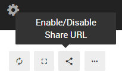
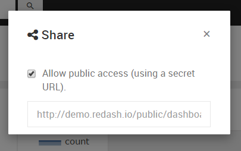

# Dashboards

* [How to Create a Dashboard?](#create_new_dash)
* [Adding Visualizations to Dashboards](#add_viz_to_dash)
* [Grouping Dashboards](#grouping_dashs)
* [How to Share Dashboard (view only)?](#sharing_dashs)
* [Embedding Dashboards](#embed_dash)
* [Dashboard Filters (flags)](#dash_filters_flags)

## How to Create a Dashboard? {#create_new_dash}

A dashboard is a combination of visualizations and text boxes.
For detailed instructions, scroll some more.

You can add a new dashboard via the Dashboard menu (bottom item will be New Dashabord) or via the home screen:

After naming your dashboard, you can start adding widgets to it from your existing query visualizations or create different commentary texts.

Select an existing query or add a text, you can select between 2 sizes - regular (half screen width) or double (full screen width).

## Adding Visualizations to Dashboards {#add_viz_to_dash}

A dashboards is a tool to aggregate multiple query datasets, visualizations and texts into one nifty view. To add widgets to your dashboard, select a query you want to feature and the visualization you want for it. By default, queries results are shown in a table.

At the moment it's not possible to create a new visualization from the "Add Widget" menu, so you'll need to open the query and add the visualization there beforehand ([instructions](../visualization/visualization.md#create_new_viz))

## Grouping Dashboards {#grouping_dashs}

It is possible to group multiple dashboards in the dashboards menu. To do this, you need to follow a naming convention by using a column (:) to separate the dashboard group and the actual dashboard name.

For example, if you name 2 dashboards "Foo: Bar" and "Foo: Baz", they will be grouped under the Foo namespace in the dropdown menu.

## Sharing Dashboard (view only) {#sharing_dashs}

You can share existing dashboards with external users (they'll see only the widgets, without the navigation and other buttons from the Redash app).

To share a dashboard, toggle the share URL and send the secret link that gets generated:

## Embedding Dashboards {#embed_dash}
To embed a dashboard, add `?fullscreen` to the sharing URL.

## Dashboard Filters (flags) {#dash_filters_flags}

If you’ve got queries that have some filters and you want to apply filters at the dashboard level (that apply to all queries), you need to set a flag.

You can do it through the admin interface at /admin/dashboard or manually by setting the column dashboard_filters_enabled of the table dashboards to TRUE in the Redash database.

If you are using the hosted service and wish to enable it for your dashboard/s - please contact us and send the URL of the dashboard you want to apply the filter/s for. Make sure to add filters to each query you want to filter in tat dashboard.
