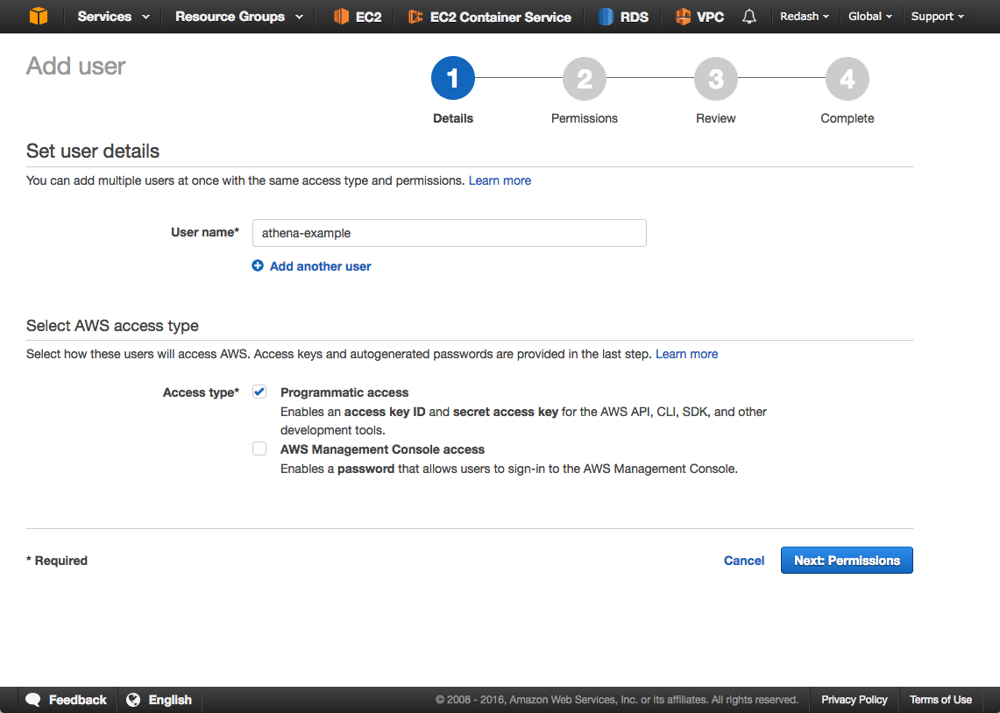
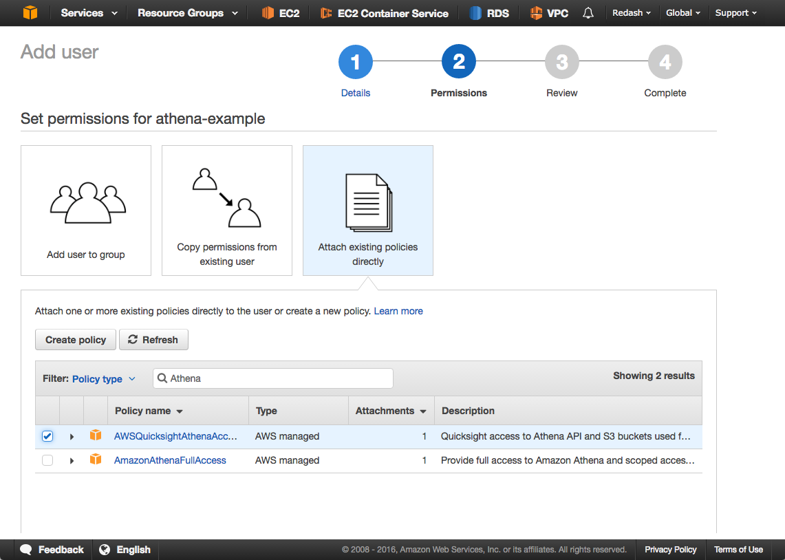
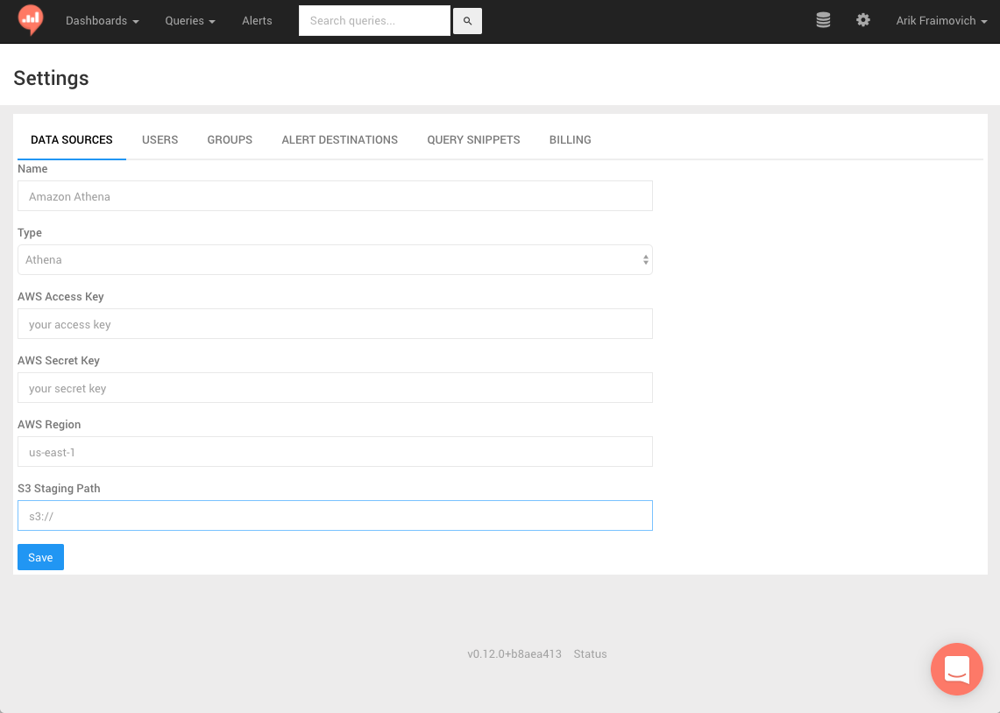

# Amazon Athena

## IAM User Setup

First you need to create an IAM user that will have permissions to run queries with Amazon Athena and access the S3 buckets that contain your data.

### Create IAM Policy to Allow Access to Your S3 Bucket

1. Sign in to the IAM console at https://console.aws.amazon.com/iam/.
2. In the navigation pane, choose **Policies**, and then **Create Policy**.

In the policy body you can use a policy similar to:

```
{
    "Version": "2012-10-17",
    "Statement": [
        {
            "Effect": "Allow",
            "Action": [
                "s3:GetObject"
            ],
            "Resource": [
                "arn:aws:s3:::my-bucket/*"
            ]
        },
        {
            "Effect": "Allow",
            "Action": [
                "s3:GetBucketLocation",
                "s3:ListBucket"
            ],
            "Resource": [
                "arn:aws:s3:::my-bucket"
            ]
        }
    ]
}
```
Of course change **my-bucket** to your bucket name. You can list several buckets, just note that we have separate permissions for the bucket (`arn:aws:s3:::my-bucket`) and the objects (`arn:aws:s3:::my-bucket/*`).

### Create IAM User

- Sign in to the IAM console at https://console.aws.amazon.com/iam/.
- In the navigation pane, choose **Users**, and then **Add User**.
- Enter the desired **User Name**.
- Check the check box next to **Programmatic Access** and then click on **Next**.



- In the **Permissions** step, select **Attach existing policies directly** and attach the **AWSQuicksightAthenaAccess** policy along with the one to access S3 buckets you created previously.



- Click on **Next**, review all the details and then **Create User**.
- Take note of the **Access Key ID** and **Secret Access Key**.

## Create Athena Data Source

In Redash, in the New Data Source page select "Athena" as type and then fill out the details using the information from the previous step:

- AWS Access Key and AWS Secret Key are the ones from the previous step.
- AWS Region is the region where you use Amazon Athena.
- S3 Staging Path is a bucket Amazon Athena uses for staging, you might have created it already if you used Amazon Athena from AWS console - just copy the same path.



## Run a Query

Everything setup, you can now query your data with **Amazon Athena**.
