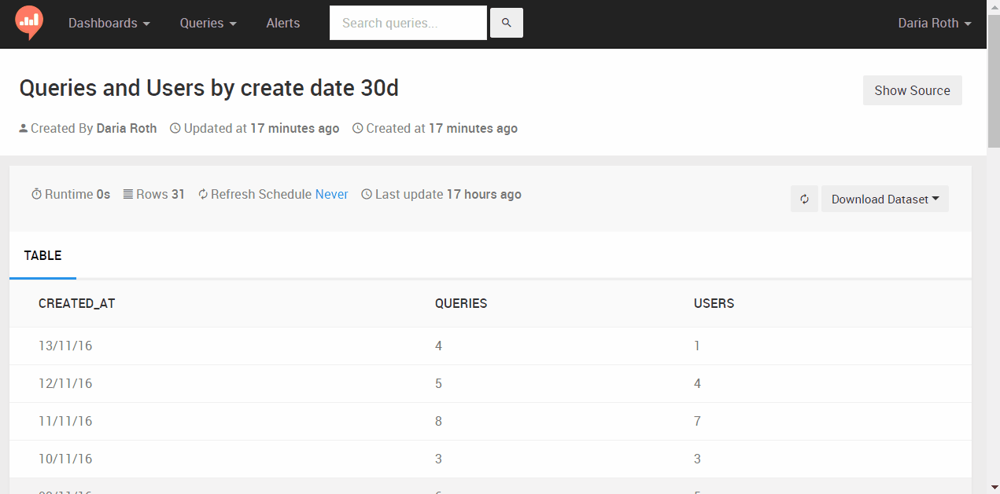
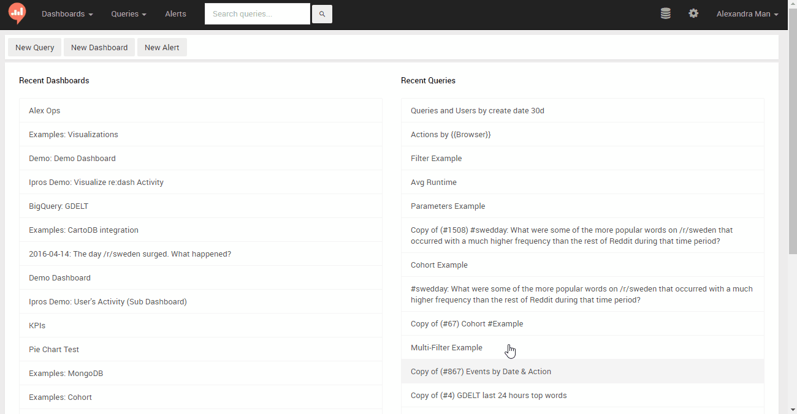

# Getting Started with Redash

To get the most out of Redash, we recommend following these 5 steps:
* [Add a Datasource](#add-datasource)
* [Write a Query](#write_queries)
* [Add a Visualization](#add-viz)
* [Create a Dashboard](#create_new_dash)
* [Invite Colleagues](#invite-users)

You can browse the different sections in the Help Center for a more in depth review of Redash's functions and how-to's but this guide should get you started easily.

## Adding Datasources to Redash {#add-datasource}

To start using Redash, connect at least one data source ([full list](../aboutrd/aboutrd.md#supported_data_sources) )

You can add a new datasource from the quick link at the navigation bar:

Or via the Data Source tab in your admin settings:

> #### primary::Important
>
> If you're using the hosted Redash service, you need to allow access from the IP address 52.71.84.157 in your database firewall/security groups (unless it's publicly available).
>
> We recommend using a user with read only permissions for the database (BigQuery is an exception, read more (here)[../data-sources/bigquery.md#bigquery-user-role]))

## Writing Queries {#write_queries}

Once you have at least one data source connected, give it a go and write a query in our comfy query editor.

Click "New Query" on the home page or under the Queries menu in the navigation bar. For detailed instructions about writing queries [click here](../queries/writing_queries.md), for query actions and options [click here](../queries/query_actions.md).

If it's your first time using a query editor or if you're unsure about the structure of your schema, you can always [explore the schema](../queries/writing_queries.md#exploring-schemas).

## Adding Visualizations {#add-viz}

Query results (good old tables) are great but visualizations are even better to digest complex info. Redash supports [9 types of visualizations](../visualization/visualization.md#viz_types) so you should find one that suits your needs (let us know if something is missing).

Click the "New Visualization" button just above the results or view more detailed instructions [here](../visualization/visualization.md#viz_types).

## Creating Dashboards {#create-dash}

Combine visualizations and text into thematic dashboards easily and share them in minutes. You can add a new dashboard via the Dashboard menu (bottom item will be New Dashabord) or via the home screen. For more details, [click here](../dashboards/dashboards.md).

## Invite Colleagues {#invite-users}

Redash is better together.

This is only for admins - invite your mates to user Redash to enjoy its collaborative nature.

Users can view others' queries for inspiration (or debugging ;) ), fork them to create similar queries of their own, view and create dashboards and share with other in your team insights vie Email, Slack or HipChat.
