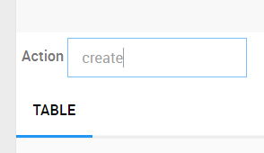

# Writing Queries

* [How to Write a Query?](#how_to_write_a_query)
* [Exploring Schemas](#exploring-schemas)
* [Query Snippets and Shortcuts](#query_snippets)
* [How to Use Parameters?](#query_params)
* [How to Add a Filter to a Query?](#query_filters)
* [Query Snippets and Shortcuts](#query_snippets)


## How to Write a Query? {#how_to_write_a_query}

For SQL databases just use the native syntax for that database.

For NoSQL languages Redash has a few nuances:

* [Querying ElasticSearch](querying_elasticsearch.md)
* [Querying JIRA (JQL)](querying_jira_jql.md)
* [Querying MongoDB](querying_mongodb.md)


Redash supports **live auto-complete** - just start typing and you'll get the relevant suggestions.
For schemas with more than 5000 tables+columns start typing and then hit ctrl/cmd+spacebar to see suggestions.

## Exploring Schemas {#exploring-schemas}

Once you select the data source you want to query, its schema will appear to the left. Clicking each table will show its columns.

You can also search for columns in the query editor search bar!
Most databases should properly show the schema, please contact us if you encouter an issue with that.

Please note that schemas update periodically - to update it immediately use the API or contact us.

## Query Snippets {#query_snippets}

Query snippets are small (or not so small) pieces of queries you want to share with your team to reduce the need to type them over and over again or looking for a reference.

You create them at `https://app.redash.io/<your company>/query_snippets` (currently only admins can create them, but anyone can use).


A snippet can be something like: (the ${1:table} part is a placeholder)

      ```sql
      JOIN organizations org ON org.id = ${1:table}.org_id
      ```

Then you can trigger them while writing a query with the trigger word you define - it'll be suggested (auto-completed) like all other fields.

## How to Use Parameters? {#query_params}

You can add parameters to your query to make it easier to edit outside the source code.

Here is a small example the demonstrates adding a date picker to a query/chart:

      ```sql
      SELECT DATE, COUNT(*)
      FROM mytable
      WHERE DATE = "{{date}}"
      ```


The `{{date}}` part is the parameter. It can be called whatever you want.

After you add it, you will see an input field show up. Next to it there is a gear icon - when clicked it opens an options screen where you can set the parameter type and friendly name.

This is how an "action" parameter looks:



**Please note that you'll need to re-execute the query with the newly set parameter to get the desires results.**

While parameters work in dashboards, they won't work when embedding visualizations outside of Redash.

## How to Add a Filter to a Query? {#query_filters}

It is possible to have filters for query results and visualizations. Thanks to filters, you can restrain the result to a certain or multiple values. Filters are enabled by following a naming convention for columns.

If you want to focus only on a specific value, you will need to alias your column to `<columnName>::filter` . Here is an example:

      ```sql
      SELECT action AS "action::filter", COUNT (0) AS "actions count"
      FROM events
      GROUP BY action
      ```

You can see this query and the rendered UI here: http://demo.redash.io/queries/143/source#table


If you are interested in multi filters (meaning that you can select multiple values), you will need to alias your column to `<columnName>::multi-filter`. Here is an example:

      ```sql
      SELECT action AS "action::multi-filter", COUNT (0) AS "actions count"
      FROM events
      GROUP BY action
      ```

You can see this query and the rendered UI here: [http://demo.redash.io/queries/144/source#table](http://demo.redash.io/queries/143/source#table)


Note that you can use `__filter` or `__multiFilter`, (double underscore instead of double quotes) if your database doesn’t support :: in column names (such as BigQuery).

## Shortcuts {#shortcuts}

Execute = ctrl+ enter or cmd+ enter

Save = ctrl+S or cmd+S

Auto-complete - for schemas with more than 5000 tables+columns start typing and then hit ctrl+spacebar or cmd+spacebar to see suggestions. For smaller schemas just typing will trigger the relevant suggestions.
